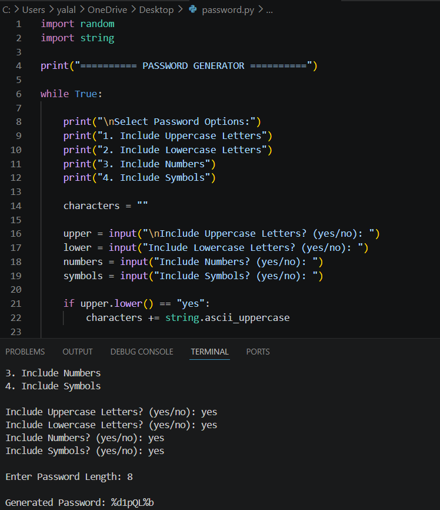

# Password Generator - Python Project

## Description

A Python-based Password Generator developed as part of the CodSoft Internship.

This application generates secure random passwords using uppercase letters, lowercase letters, numbers, and special characters.

---

## Technologies Used

- Python
- random module
- string module

---

## Features

- Generates strong random passwords
- Includes letters, numbers, and symbols
- User customizable options
- Interactive command-line interface

---

## Output Screenshot

---

## Demo Video

[Watch Demo Video on you tube](https://youtu.be/o-j48tztzAU)

---
